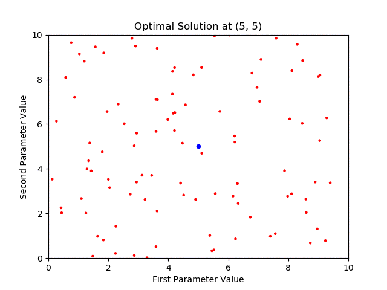

# PyGenetics: Genetic Algorithm for Tuning Function Parameters

[](https://badge.fury.io/gh/tjkessler%2FPyGenetics)
[](https://badge.fury.io/py/pygenetics)
[](https://raw.githubusercontent.com/TJKessler/PyGenetics/master/LICENSE.txt)
[](https://dev.azure.com/travisjkessler/personal-repos/_build/latest?definitionId=7&branchName=master)

PyGenetics is an open source Python package used to tune parameters for user-supplied functions. Inspired by [genetic algorithms](https://www.researchgate.net/profile/Darrell_Whitley2/publication/2425017_A_Genetic_Algorithm_Tutorial/links/563214a108ae506cea68fd96/A-Genetic-Algorithm-Tutorial.pdf), PyGenetics is able to optimize variables in a multidimensional search space to minimize a "cost" (e.g. an error value returned by the user-supplied function).

<p align="center">
  
</p>

# Installation:

### Method 1: pip
```
pip install pygenetics
```

To update your version of PyGenetics to the latest version, use:
```
pip install --upgrade pygenetics
```

### Method 2: From source
Download the PyGenetics repository, navigate to the download location on the command line/terminal, and execute:
```
pip install .
```

There are currently no additional dependencies for PyGenetics.

# Usage:

To start using PyGenetics, you need a couple items:
- a cost function (objective function) to optimize
- parameters used by the cost function

For example, let's define a cost function to minimize the sum of three integers:

```python
def minimize_integers(integers):

    return sum(integers)

```

Your cost function must accept a **list** from PyGenetics. The list values represent the current solution, i.e. parameter values, being evaluated by a population member

Now that we have our cost function, let's import the Population object from PyGenetics, initialize the population, and add our parameters/genes:

```python
from pygenetics import Population

def minimize_integers(integers):

    return sum(integers)

pop = Population(10, minimize_integers)
pop.add_param(0, 10)
pop.add_param(0, 10)
pop.add_param(0, 10)
```

Here we initialize the population with 10 population members, supply our cost function and add our parameters/genes. Parameters are added with minimum/maximum values for its search space. By default, parameter mutations (searching a neighboring solution) will not exceed the specified parameter bounds [min_val, max_val]; if this limitation is not desired, supply the "restrict=False" argument:

```python
pop.add_param(0, 10, restrict=False)
```

Once we have created our population and added our parameters/genes, we then need to "initialize" the population's members:

```python
from pygenetics import Population

def minimize_integers(integers):

    return sum(integers)

pop = Population(10, minimize_integers)
pop.add_param(0, 10)
pop.add_param(0, 10)
pop.add_param(0, 10)
pop.initialize()
```

Initializing the population's members (in this example, 10 members) deploys them to random solutions/chromosomes (a random parameter/gene set is created), and their fitness is evaluated (in this example, lowest sum is better).

We then compute a pre-determined number of generations, each derived from the previous generation's members:

```python
from pygenetics import Population

def minimize_integers(integers):

    return sum(integers)

pop = Population(10, minimize_integers)
pop.add_param(0, 10)
pop.add_param(0, 10)
pop.add_param(0, 10)
pop.initialize()
for _ in range(10):
    pop.next_generation()
```

Computing the next generation consists of:

- **1.** Select a chromosome (parameter/gene set) from the population based on fitness (a higher fitness score results in a higher chance of being chosen)

- **2a.** Perform crossover with probability _p<sub>c</sub>_ (default of 0.5, 50%); if crossover is not performed, perform step (2b)

    - Select a different chromosome per method in (1)
    - Select a crossover point between 1 and L-1 (random index in chromosomes' genes) with uniform probability
    - Recombine chromosomes to form two offspring
    - Perform mutation on each gene with probability _p<sub>m</sub>_ (default of 0.01, 1%)
    - Place both offspring in the next generation
    
- **2b.** Crossover not performed, perform mutation on each gene of the chromosome with probability _p<sub>m</sub>_ (default of 0.01, 1%), place chromosome in the next generation

- **3.** If the next generation is not full (less than total population size), continue from step (1)

Both _p<sub>c</sub>_ and _p<sub>m</sub>_ can be adjusted when the next generation is created:

```python
pop.next_generation(p_crossover=0.75, p_mutation=0.05)
```

We can access the populations's average fitness score, average objective function return value, best fitness score, best objective function return value and best parameters at any time:

```python
print(pop.average_fitness)
print(pop.average_ret_val)
print(pop.best_fitness)
print(pop.best_ret_val)
print(pop.best_params)
```

PyGenetics can utilize multiple CPU cores for concurrent processing:

```python
pop = Population(10, minimize_integers, num_processes=8)
```

Tying everything together, we have:

```python
from pygenetics import Population

def minimize_integers(integers):

    return sum(integers)

pop = Population(10, minimize_integers)
pop.add_param(0, 10)
pop.add_param(0, 10)
pop.add_param(0, 10)
pop.initialize()
for _ in range(10):
    pop.next_generation()
    print('Average fitness: {}'.format(pop.average_fitness))
    print('Average obj. fn. return value: {}'.format(pop.average_ret_val))
    print('Best fitness score: {}'.format(pop.best_fitness))
    print('Best obj. fn. return value: {}'.format(pop.best_ret_val))
    print('Best parameters: {}\n'.format(pop.best_params))
```

Running this script produces:

```
Average fitness: 0.11519380797455661
Average obj. fn. return value: 9.545454545454545
Best fitness score: 0.25
Best obj. fn. return value: 3
Best parameters: [1, 0, 2]

Average fitness: 0.16551587301587303
Average obj. fn. return value: 5.6
Best fitness score: 0.25
Best obj. fn. return value: 3
Best parameters: [1, 0, 2]

Average fitness: 0.1694047619047619
Average obj. fn. return value: 5.5
Best fitness score: 0.25
Best obj. fn. return value: 3
Best parameters: [1, 0, 2]

Average fitness: 0.18857142857142856
Average obj. fn. return value: 4.9
Best fitness score: 0.25
Best obj. fn. return value: 3
Best parameters: [1, 2, 0]

Average fitness: 0.19935064935064933
Average obj. fn. return value: 5.0
Best fitness score: 0.5
Best obj. fn. return value: 1
Best parameters: [1, 0, 0]

Average fitness: 0.2946969696969697
Average obj. fn. return value: 3.1818181818181817
Best fitness score: 0.5
Best obj. fn. return value: 1
Best parameters: [1, 0, 0]

Average fitness: 0.29416666666666663
Average obj. fn. return value: 3.2
Best fitness score: 0.5
Best obj. fn. return value: 1
Best parameters: [1, 0, 0]

Average fitness: 0.25844155844155847
Average obj. fn. return value: 3.5454545454545454
Best fitness score: 0.5
Best obj. fn. return value: 1
Best parameters: [1, 0, 0]

Average fitness: 0.3538961038961039
Average obj. fn. return value: 2.727272727272727
Best fitness score: 0.5
Best obj. fn. return value: 1
Best parameters: [1, 0, 0]

Average fitness: 0.4772727272727273
Average obj. fn. return value: 1.1818181818181819
Best fitness score: 0.5
Best obj. fn. return value: 1
Best parameters: [1, 0, 0]
```

To run this script yourself, head over to our [examples](https://github.com/tjkessler/PyGenetics/tree/master/examples) directory.

# Contributing, Reporting Issues and Other Support:

To contribute to PyGenetics, make a pull request. Contributions should include tests for new features added, as well as extensive documentation.

To report problems with the software or feature requests, file an issue. When reporting problems, include information such as error messages, your OS/environment and Python version.

For additional support/questions, contact Travis Kessler (travis.j.kessler@gmail.com).
